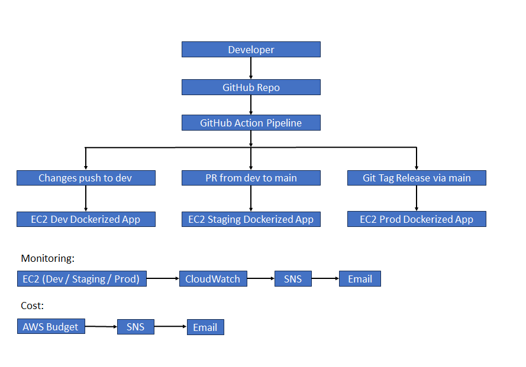
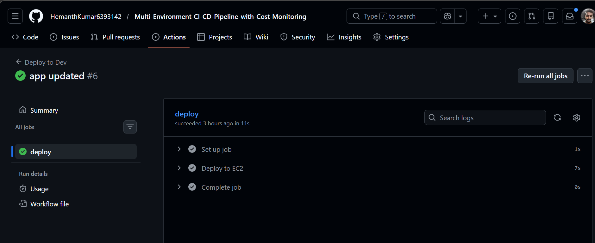
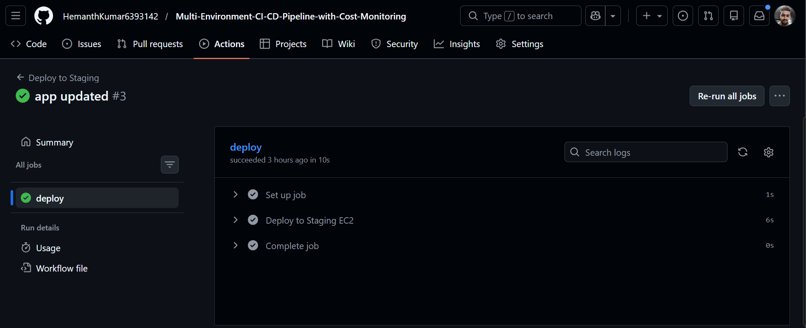
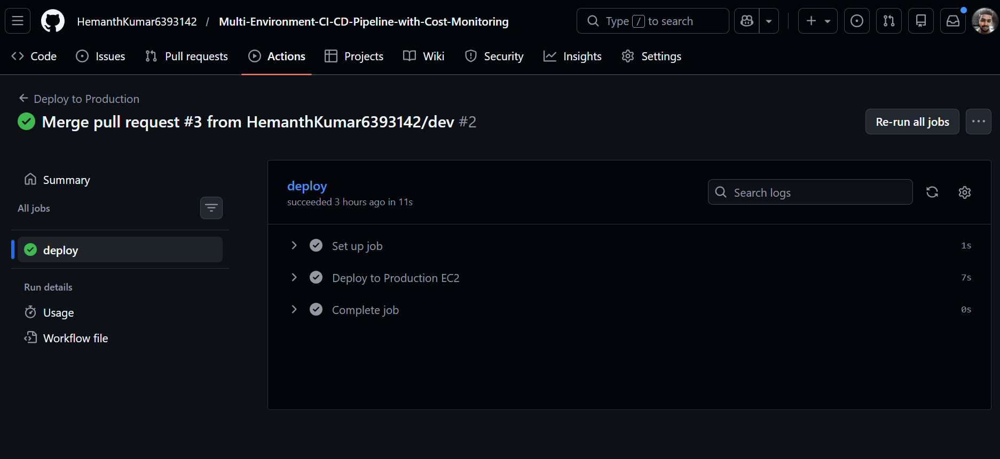
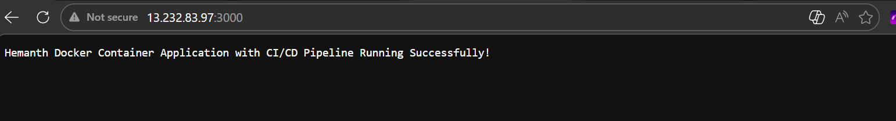
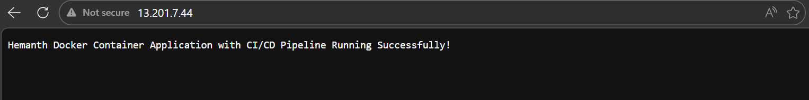
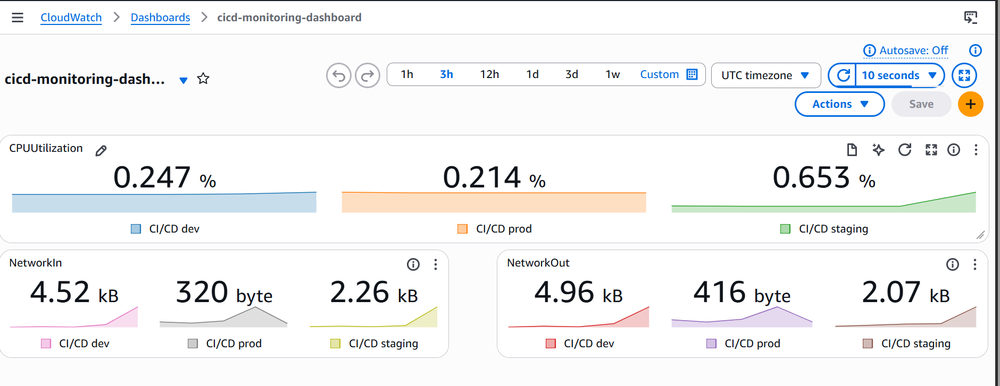
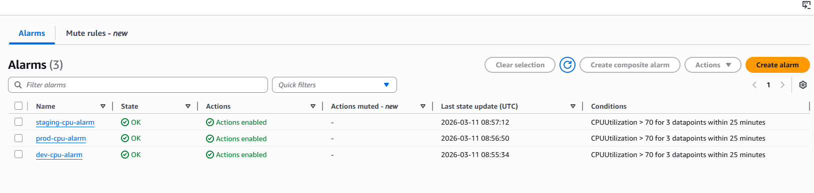
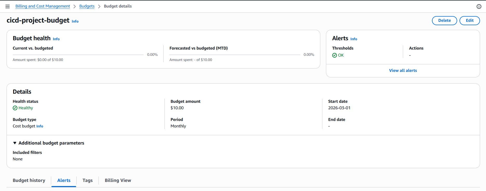

# Multi-Environment CI/CD Pipeline with Cost Monitoring

## 📌 Project Overview
This project demonstrates a real-world DevOps CI/CD pipeline that automates application deployment across **Development, Staging, and Production environments** using GitHub Actions and Docker on AWS EC2.  
It also implements **infrastructure monitoring and cost governance** using AWS CloudWatch, SNS, and AWS Budgets.

---

## 🎯 Problem Statement
Manual deployments across environments often lead to:
- Inconsistent releases
- Deployment errors
- Lack of monitoring visibility
- Unexpected cloud cost overruns

This project solves these challenges by implementing an automated multi-environment deployment pipeline with monitoring and cost alerts.

---

## 🏗 Architecture

---

## ⚙️ CI/CD Workflow

### Development Deployment
- Code pushed to **dev branch**
- GitHub Actions triggers automated deployment to **Dev EC2**

### Staging Deployment
- Pull Request created from **dev → main**
- Merge triggers deployment to **Staging EC2**

### Production Deployment
- Release created via **Git Tag (vX.X.X)**
- Tag push triggers deployment to **Production EC2**

---

## 🐳 Containerization
- Application is containerized using Docker
- Docker images are built during deployment
- Containers run on EC2 instances per environment

---

## 📊 Monitoring & Alerting
- CloudWatch CPU utilization alarms configured
- Centralized CloudWatch Dashboard
- SNS email notifications for infrastructure alerts

---

## 💰 Cost Governance
- AWS Budget configured with:
  - 80% cost threshold alert
  - 100% forecast alert
- Integrated with SNS for real-time cost monitoring

---

## 🛠 Tech Stack
- AWS EC2
- AWS CloudWatch
- AWS SNS
- AWS Budgets
- GitHub Actions
- Docker
- Linux

---

## 🚀 Key DevOps Concepts Demonstrated
- Multi-environment deployment strategy
- Branch protection governance
- PR-based release promotion
- Production release versioning via Git tags
- Infrastructure monitoring & alerting
- Cloud cost optimization

---

## 📷 Project Screenshots

### 🔹 CI/CD Pipeline Execution

#### Dev Deployment (Push to dev branch)

#### Staging Deployment (PR merge to main)

#### Production Deployment (Git Tag Release)

---

### 🔹 Application Running

#### Application Running in Dev Environment

#### Application Running in Staging Environment

#### Application Running in Production Environment

---

### 🔹 Monitoring & Alerts

#### CloudWatch Dashboard

#### CloudWatch Alarm Configuration

---

### 🔹 Cost Monitoring

#### AWS Budget Configuration

---

## 📈 Future Improvements
- Add automated testing stage (CI)
- Implement Infrastructure as Code (Terraform)
- Add Docker registry integration (ECR/DockerHub)
- Introduce blue-green deployment

---

## 👨‍💻 Author
Hemanth Kumar